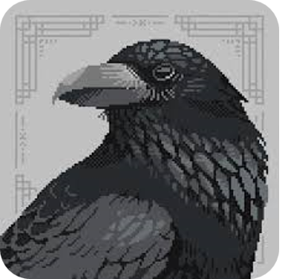
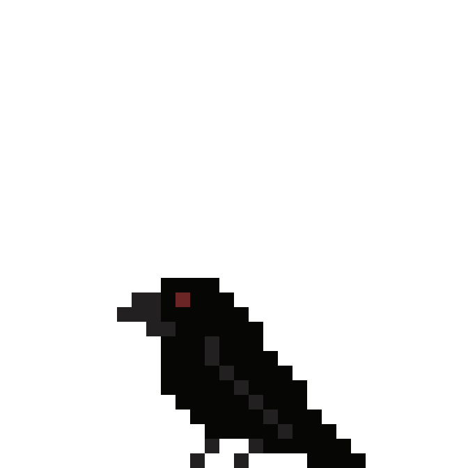

### Shafayat Hossain **Majumder**
Prospective MASc (Information Systems Security) Student @[Concordia](https://www.concordia.ca/ginacody.html) |  
CSE Graduate from [BUET](https://cse.buet.ac.bd/) | Cybersecurity Enthusiast

 

## **Interests**

`Cloud Security` `Cybersecurity` `Blockchain` `Software Development` `Web Development`

## **Technical Skills**
| Topics                    | Skills |
|---------------------------|-------------------|
| **Languages**             | JavaScript, Python, C, C++, Java, SQL, PHP, Shell |
| **Frameworks**            | React, Express, Node, Django, JavaFX, WordPress |
| **Databases**             | MongoDB, Oracle, MySQL, Firebase |
| **Web Technologies**      | HTML5, CSS3, SASS, BootStrap, JSON |
| **Cloud Technologies**    | Docker, Kubernetes, Google Apps Script |
| **Tools**                 | Git (GitHub), Jupyter, LaTeX |
| **Problem Solving**       | CodeForces (highest ranking: 1587), SPOJ |
| **Testing**               | JUnit, GDB |
| **Operating Systems**     | Windows, Flavors of Linux (Ubuntu, Linux Mint, Kali), ChromeOS |

## **Statistics**

### **Foot Note**
Beyond academia and research, I am a foodie, lose in chess, do novice photography and enjoy playing the ukulele. I also actively seek opportunities for skill-building, collaboration, and engaging in conversations with new people; so feel free to `hmu`.

    

------

