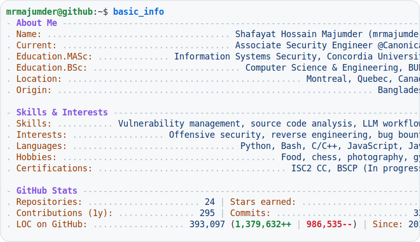

<!-- profile-dashboard:start -->
<picture>
  <source media="(prefers-color-scheme: dark)" srcset="./assets/profile-dark.svg">
  
</picture>
<!-- profile-dashboard:end -->

  &nbsp;&nbsp;
  &nbsp;&nbsp;
  &nbsp;&nbsp;
  &nbsp;&nbsp;
  

